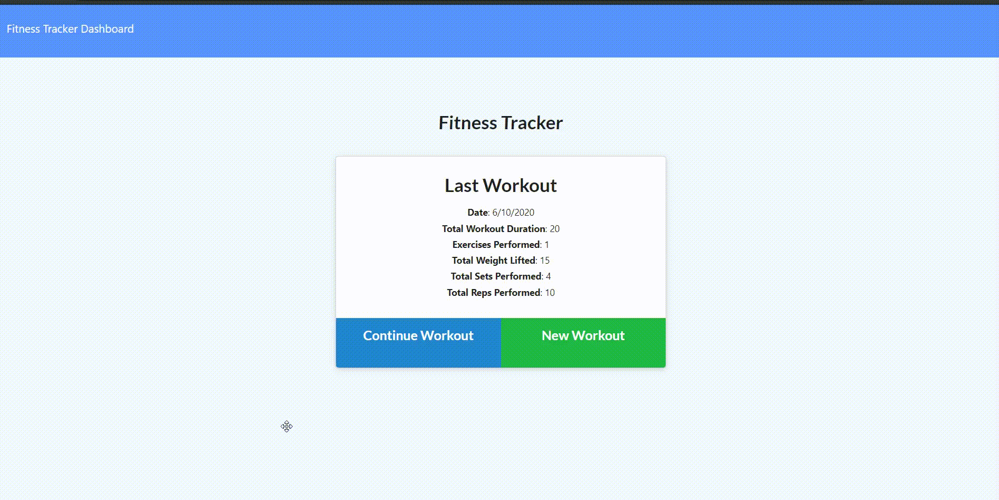

# workout_tracker

### Deployed Heroku URL:
https://fitnesstracker1981.herokuapp.com/


## Badges
[](https://img.shields.io/github/followers/mathigayathri2001?style=social)

[](https://img.shields.io/npm/l/isc?color=Blue&style=plastic)


## User-story
```
As a user, I want to be able to view create and track daily workouts. 
I want to be able to log multiple exercises in a workout on a given day. 
I should also be able to track the name, type, weight, sets, reps, and duration of exercise. 
If the exercise is a cardio exercise, I should be able to track my distance traveled.

```

## Table of Content 
   * [UserStory](#Userstory)
   * [Description](#description)
   * [Usage](#usage)
   * [Built with](#built-with)
   * [Installation](#installation)
   * [Badges](#badges)
   * [Contributing](#contributing)
   * [License](#license)
   * [Visuals](#visuals)

## Description
This application allows the user to create and track their workouts. They can keep track of multiple exercises in a workout. The user has the option to record either a resistance or cardio exercise. A resistance exercise will contain the following information: name, weight, sets, reps and duration, while a cardio exercise has name, duration and distance traveled.

## Instructions
* Run npm install to install all dependencies. 
* Run node server, To use the application locally, 
* Open the  http://localhost:3000 
* The Fitness Tracker app is live on Heroku for you to use as well.


## Built with
* JavaScript
* NodeJS
* Node Packages:
* MongoDB
* Mongoose
* Express
* morgan


## Visuals


## Installation
Run npm install to install all dependencies. To use the application locally run server.js

## Usage
```sh
node server.js
```

## License
[](https://img.shields.io/npm/l/isc?color=Blue&style=plastic)

## Question

https://github.com/mathigayathri2001

  

 